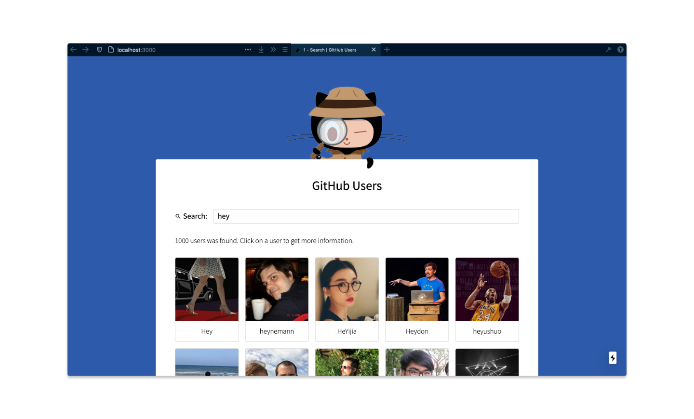

# Github Users - A Tech Task For Homeday 🏠

Live: <https://github-users-alpha.vercel.app>

## 📝 Description
Fast and robust React SPA to search for users on GitHub and view their key information.
This is a [Next.js](https://nextjs.org/) project bootstrapped with [`create-next-app`](https://github.com/vercel/next.js/tree/canary/packages/create-next-app).

For detailed information about project structure, tools, gotchas, thoughts and acknowledgements, please read the [documentation](docs/documentation.md).  
To get an overview of the working process check the [tasks](docs/tasks.md) list.

## 🚀 Start It

1. Clone this project  
`git clone https://github.com/fools-mate/github-users`

    You can also use SSH if you like, when its configured. [(HowTo)](https://docs.github.com/en/github/authenticating-to-github/connecting-to-github-with-ssh)   
    `git clone git@github.com:fools-mate/github-users.git`

2. Open project directory  
`cd github-users`

3. Install dependencies  
`npm install` or `yarn install`

4. Run the project   
`npm run dev` or `yarn dev` 

5. Open [http://localhost:3000](http://localhost:3000) 

The project is now started in development mode. 
If you want to deploy it, look below.

## 🔎 Check It

### TypeScript
Check for errors with:  
`npm run lint:ts` or `yarn lint:ts`  

Try to fix automatically with:  
`npm run fix:ts` or `yarn fix:ts`

Reformat your code with:  
`npm run prettier:fix` or `yarn prettier:fix`  

### CSS / Sass / CSS-in-JS
Check for errors with:  
`npm run lint:css` or `yarn lint:css`  

Try to fix automatically with:  
`npm run fix:fix` or `yarn fix:css`

## ✅ Test It 
Launches the test runner in the interactive watch mode:  
`npm test` or `yarn test`

Show the test coverage:  
`npm run test:coverage` or `yarn test:coverage`

## 🔨 Build It, 🛳 Ship It
`npm run build` or `yarn build`

Builds the app for production to the `build` folder.  

The easiest way to deploy this Next.js app is to use the [Vercel Platform](https://vercel.com/import?utm_medium=default-template&filter=next.js&utm_source=create-next-app&utm_campaign=create-next-app-readme) from the creators of Next.js.
Check out this [Next.js deployment documentation](https://nextjs.org/docs/deployment) for more details.
