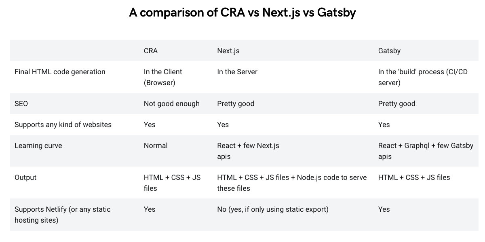

# Documentation

## 🏛 Project Structure

    📂 root
    ├── 📁 build
    ├── 📂 docs
    │  ├── 📁 imgages
    │  └── 📃 markdown files..
    ├── 📁 public
    ├── 📁 src
    │  ├── 📁 __tests__
    │  ├── 📂 assets
    │  │  ├── 📁 icons
    │  │  └── 📁 images
    │  ├── 📁 components
    │  ├── 📁 global
    │  ├── 📁 pages
    │  │  ├── 📂 users
    │  │  │   └── 📃 [username].ts (dynamic route)
    │  │  └── 🏠 index.ts
    │  ├── 📁 styles
    │  └── 📁 tests
    ├── 📃 .gitignore
    ├── 📃 configs...
    ├── 📃 package.json
    └── 📃 README.md

## 🛠 Tools

### Next.js
The main reason why I choose Next.js is that unlike Gatsby, it's very good for dynamic content with the advantages of server-side rendering out of the box.
At first, I thought about starting with CRA(create-react-app), but I didn't want to [eject](https://medium.com/curated-by-versett/dont-eject-your-create-react-app-b123c5247741) the project or use another dependency(react-app-rewired) to configure Webpack.

Here a small comparison:

<https://coffeencoding.com/cra-vs-next-js-vs-gatsby/>

### Other Tools:
- TypeScript
- Prettier
- Eslint
- Stylelint
- Jest
- Styled components
- Conventional Commits 

## 💭 Thoughts

## 🔴 Gotchas

## 🎉 Acknowledgements 
- ***De Code Natura (Francesco Agnoletto)*** for this great article: [How to setup NextJS with TypeScript and ESLint + Prettier](https://decodenatura.com/how-to-set-up-nextjs-typescript-eslint-prettier/)

